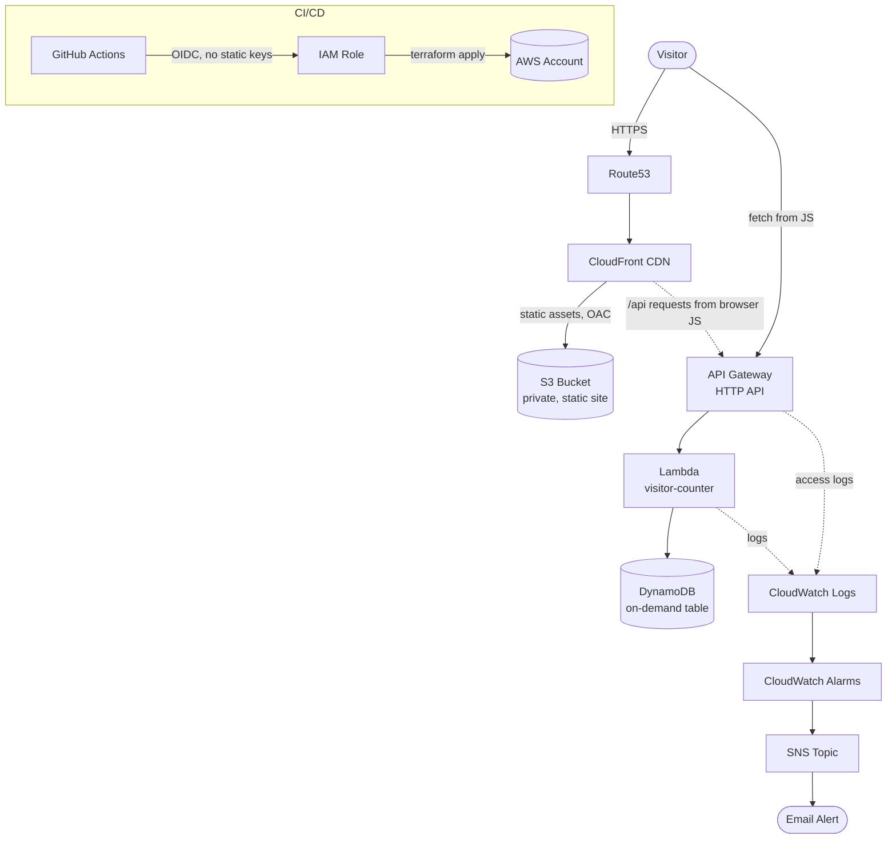

# Serverless AWS Portfolio Platform

A production-style, fully serverless web application — built to demonstrate
Infrastructure as Code, cloud architecture, and DevOps practices for a
Software Engineering / Cloud / AI internship portfolio.

A static frontend (S3 + CloudFront + Route53) calls a serverless backend
(API Gateway + Lambda + DynamoDB). Everything is provisioned by modular
Terraform, deployed through GitHub Actions, and stays within (or very close
to) the AWS Free Tier.

## Architecture



**Request flow:** a visitor hits the Route53 record → CloudFront serves the
static site from S3 (via Origin Access Control, bucket is otherwise
private) → the page's JavaScript calls the API Gateway endpoint → API
Gateway invokes Lambda → Lambda atomically increments a counter in
DynamoDB and returns it. Every component's logs flow to CloudWatch;
CloudWatch Alarms watch for errors and notify an SNS topic.

See [docs/ARCHITECTURE.md](docs/ARCHITECTURE.md) for the full breakdown,
including the IAM trust/permission model and key Terraform design
decisions.

## Tech Stack

| Layer            | Service                        |
|-------------------|--------------------------------|
| DNS               | Route53                        |
| CDN / TLS         | CloudFront + ACM                |
| Frontend hosting  | S3 (private, OAC-only access)  |
| API               | API Gateway (HTTP API)         |
| Compute           | Lambda (Python 3.12)            |
| Database          | DynamoDB (on-demand)           |
| Observability     | CloudWatch Logs, Alarms, SNS    |
| IAM               | Least-privilege roles, GitHub OIDC federation |
| IaC               | Terraform (modular, S3 remote state + DynamoDB locking) |
| CI/CD             | GitHub Actions                 |

## Repository Structure

```
.
├── .github/workflows/        # CI/CD pipelines (plan, dev apply, prod apply, tests, website deploy)
├── terraform/
│   ├── bootstrap/            # One-time: creates the remote state S3 bucket + lock table
│   ├── modules/               # 9 reusable modules (one per AWS service/concern)
│   │   ├── s3-static-site/
│   │   ├── acm-certificate/
│   │   ├── route53/
│   │   ├── cloudfront/
│   │   ├── dynamodb/
│   │   ├── lambda/
│   │   ├── api-gateway/
│   │   ├── monitoring/
│   │   └── iam-github-oidc/
│   └── environments/
│       ├── dev/               # Wires modules together for dev
│       └── prod/              # Wires modules together for prod
├── lambda/
│   ├── src/handler.py         # Visitor counter function
│   └── tests/test_handler.py  # pytest + moto unit tests
├── website/index.html         # Static frontend
└── docs/                       # Architecture, deployment, security, cost, interview prep
```

## Why This Design

- **Modular Terraform**: each AWS service is its own module with `main.tf`
  / `variables.tf` / `outputs.tf`. Environments only *compose* modules —
  they contain no resource logic of their own. Adding a third environment
  (e.g. `staging`) is a copy-paste of the `dev/` folder plus new tfvars.
- **Remote state with locking**: state lives in S3 (versioned, encrypted,
  not publicly accessible) with a DynamoDB table preventing concurrent
  `apply` runs from corrupting state — the same pattern used in real
  engineering teams.
- **No long-lived AWS keys in CI**: GitHub Actions authenticates to AWS via
  OIDC federation (`terraform/modules/iam-github-oidc`), not stored access
  keys. The trust policy is scoped to this specific repo and branch.
- **Least privilege at runtime**: the Lambda execution role can only write
  to its own CloudWatch log group and read/write its one DynamoDB table —
  not `logs:*` or `dynamodb:*` on everything.
- **Free-tier conscious**: on-demand DynamoDB, HTTP API (not REST API),
  CloudFront `PriceClass_100`, short log retention, and an optional
  custom-domain toggle so you can run the whole stack for $0 before you
  own a domain. Full breakdown in [docs/COST_OPTIMIZATION.md](docs/COST_OPTIMIZATION.md).

## Prerequisites

- AWS account with admin access (for the one-time bootstrap step)
- [Terraform](https://developer.hashicorp.com/terraform/install) >= 1.6
- AWS CLI configured locally (for the bootstrap step only — CI uses OIDC)
- A GitHub repository (this code, pushed)
- *(Optional)* A registered domain with a Route53 hosted zone, if you want
  a custom URL instead of the free `*.cloudfront.net` one

## Quick Start

Full walkthrough in [docs/DEPLOYMENT.md](docs/DEPLOYMENT.md). Short version:

```bash
# 1. One-time: create the remote state backend
cd terraform/bootstrap
cp terraform.tfvars.example terraform.tfvars   # edit: set a unique bucket name
terraform init && terraform apply

# 2. Point dev/prod at that backend
#    edit terraform/environments/dev/backend.tf and prod/backend.tf
#    with the bucket/table names from step 1's outputs

# 3. Deploy dev manually the first time
cd ../environments/dev
cp terraform.tfvars terraform.tfvars   # edit: account_id, alert_email, etc.
terraform init
terraform plan
terraform apply

# 4. Upload the website and grab the live URL
aws s3 sync ../../../website/ s3://$(terraform output -raw s3_bucket_name)
aws cloudfront create-invalidation --distribution-id $(terraform output -raw cloudfront_distribution_id) --paths "/*"
terraform output website_url
```

After that, push to `develop` to redeploy dev automatically, and to `main`
to redeploy prod (behind a manual approval gate).

## CI/CD Pipeline

| Workflow                  | Trigger                          | What it does |
|----------------------------|-----------------------------------|---------------|
| `terraform-ci.yml`         | PR to `main`/`develop`            | `fmt -check`, `validate`, `plan` for dev + prod |
| `terraform-cd-dev.yml`     | push to `develop`                 | Auto-applies to dev |
| `terraform-cd-prod.yml`    | push to `main`                    | Applies to prod, behind a required-reviewer gate |
| `lambda-tests.yml`         | PR touching `lambda/`              | Runs `pytest` (with `moto`-mocked AWS) |
| `deploy-website.yml`       | push to `main` touching `website/` | S3 sync + CloudFront cache invalidation |

## Monitoring

- Lambda errors, API Gateway 5xx rate, and DynamoDB throttling each have a
  CloudWatch Alarm wired to an SNS topic (email subscription).
- API Gateway access logs and Lambda logs are both in CloudWatch with
  environment-appropriate retention (14 days dev / 30 days prod).
- An `aws_budgets_budget` resource alerts by email at 80% of a configurable
  monthly cost threshold — a safety net against runaway spend.

## Security

See [docs/SECURITY.md](docs/SECURITY.md) for the full write-up. Highlights:
S3 bucket is fully private (CloudFront OAC only), no static AWS credentials
anywhere, IAM scoped per-resource rather than per-service, encryption at
rest on S3/DynamoDB, TLS-only (HTTPS) at the CDN edge.

## Cost

Designed to run near $0/month at low traffic. Full breakdown in
[docs/COST_OPTIMIZATION.md](docs/COST_OPTIMIZATION.md). The only line item
that isn't part of the AWS Free Tier is the Route53 hosted zone
(~$0.50/month) — and that's optional; set `enable_custom_domain = false`
to skip it entirely.

## Author

**Gentrit Krasniqi** — Final-year Computer Science student, University of
Prishtina. Built as part of an AWS / Cloud / AI Engineering portfolio.

## License

MIT — see [LICENSE](LICENSE).
