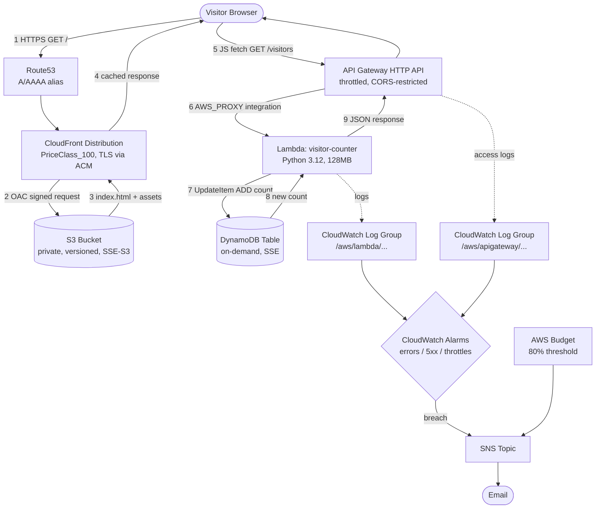
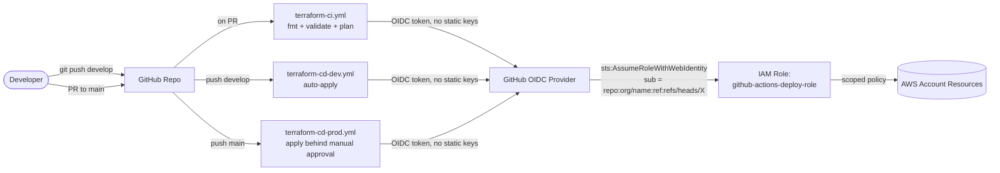

# Architecture

## Component Diagram

## CI/CD & IAM Trust Diagram

## Layer-by-Layer Notes

### DNS & CDN (Route53 + CloudFront)
- Route53 hosts an alias **A**/**AAAA** record pointing at the CloudFront
  distribution (no extra cost vs. a CNAME, and works at the zone apex).
- CloudFront is configured with `PriceClass_100` (US/Canada/Europe edge
  locations only) — sufficient for a portfolio site and meaningfully
  cheaper than `PriceClass_All`.
- Custom error responses route 403/404 back to `index.html` with a `200`,
  which is the standard pattern for single-page apps.
- The custom domain (ACM cert + Route53 record) is **optional**, gated by
  `enable_custom_domain`. Without it, the project still fully works on the
  free `*.cloudfront.net` domain — useful before you own a domain, or for
  reviewers who just want to see it run.

### Frontend Hosting (S3)
- The bucket has **no** public access, **no** static-website-hosting
  endpoint, and **no** bucket ACLs. The only way in is a bucket policy
  that allows `s3:GetObject` exclusively to the CloudFront service
  principal, further scoped by an `AWS:SourceArn` condition matching this
  exact distribution's ARN (Origin Access Control — the current
  AWS-recommended replacement for the older OAI approach).

### API (API Gateway HTTP API)
- HTTP API (`apigatewayv2`), not REST API — about 70% cheaper, and this
  project doesn't need REST-API-only features like request validators or
  usage plans.
- CORS is configured at the API level rather than in Lambda response
  headers (Lambda still sets `Access-Control-Allow-Origin` defensively in
  case the function is ever invoked outside API Gateway, e.g. tested
  directly).
- Throttling (`burst=10`, `rate=5` by default) caps worst-case cost from a
  public, unauthenticated endpoint being hammered by a bot or scanner.

### Compute (Lambda)
- Python 3.12, 128MB memory (Lambda Free Tier: 1M requests + 400,000
  GB-seconds/month — this workload uses a tiny fraction of that).
- Code is zipped at `terraform plan` time via the `archive_file` data
  source, so there's no separate "build step" to keep in sync — the
  deployed artifact always matches `lambda/src/`.
- Execution role permissions: **exactly** `logs:CreateLogStream` /
  `logs:PutLogEvents` scoped to its own log group ARN, and
  `dynamodb:GetItem` / `PutItem` / `UpdateItem` scoped to its one table
  ARN. No `dynamodb:*`, no `Resource: "*"`.

### Database (DynamoDB)
- `PAY_PER_REQUEST` billing — no capacity to provision or pay for while
  idle, and the project never needs to predict traffic.
- Server-side encryption enabled (AWS-owned key, no extra cost).
- Point-in-time recovery is on in prod, off in dev (a deliberate
  dev/prod difference — recovery matters less for disposable dev data).

### Observability (CloudWatch + SNS)
- Every Lambda invocation and every API Gateway request is logged to a
  dedicated CloudWatch Log Group with environment-tuned retention (14
  days dev, 30 days prod) — long enough to debug, short enough to avoid
  storage cost creeping up over a multi-month portfolio project.
- Three CloudWatch Alarms (Lambda errors, API Gateway 5xx, DynamoDB
  throttled requests) publish to a single SNS topic with an email
  subscription.
- An `aws_budgets_budget` resource is the last line of defense: an email
  fires automatically at 80% of a configurable monthly spend cap,
  independent of whether any individual alarm fired.

### IAM
Two *separate* IAM concerns live in this project, on purpose:

1. **Runtime least privilege** (`modules/lambda`) — what the deployed
   Lambda function itself can touch in AWS. Tight, resource-level scoping.
2. **CI/CD deploy permissions** (`modules/iam-github-oidc`) — what
   GitHub Actions can do *during a `terraform apply`*. This role is
   necessarily broader, since Terraform needs to create/modify every
   resource type in the stack. It's still scoped to: (a) only this GitHub
   repo + these branches can assume it (verified via the OIDC `sub`
   claim), and (b) no static AWS access keys exist anywhere — a leaked
   GitHub secret can't be replayed outside a workflow run, and the trust
   policy can be revoked centrally at any time. See
   [SECURITY.md](SECURITY.md) for the honest tradeoffs here.

## A Real Terraform Gotcha Worth Knowing

`modules/s3-static-site`'s bucket policy needs the CloudFront
distribution's ARN, and `modules/cloudfront`'s origin needs the S3
bucket's regional domain name — a circular reference between two
resources. This project resolves it the standard way: CloudFront's
origin domain is **constructed from the known S3 naming convention**
(`<bucket>.s3.<region>.amazonaws.com`) as a string, rather than read from
the bucket module's output. This breaks the cycle because Terraform never
needs the bucket resource to exist before planning CloudFront. This is a
genuinely common pattern in S3+CloudFront+OAC stacks and a great thing to
be able to explain in an interview.
